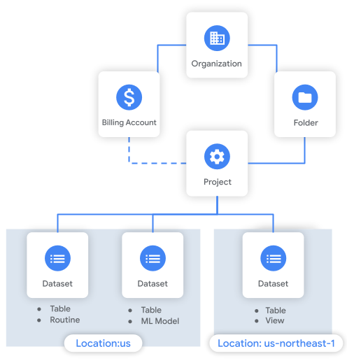
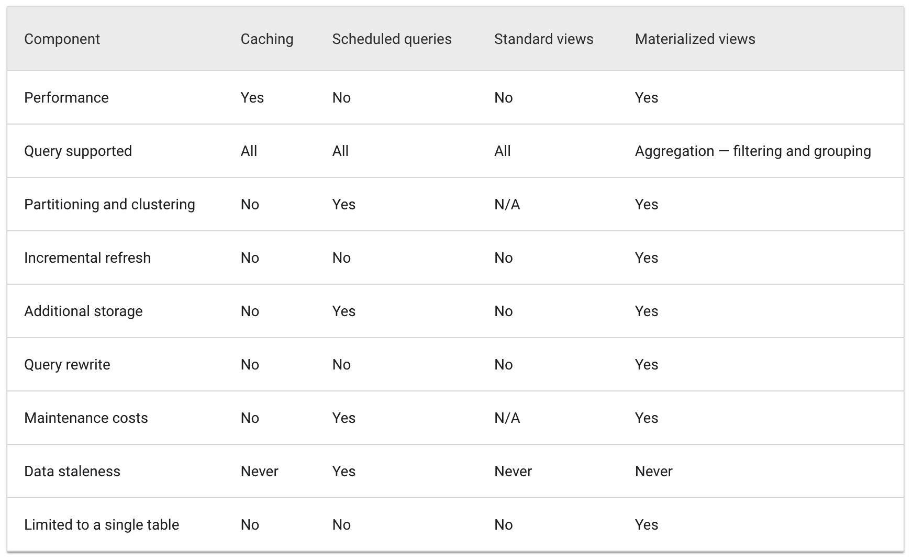
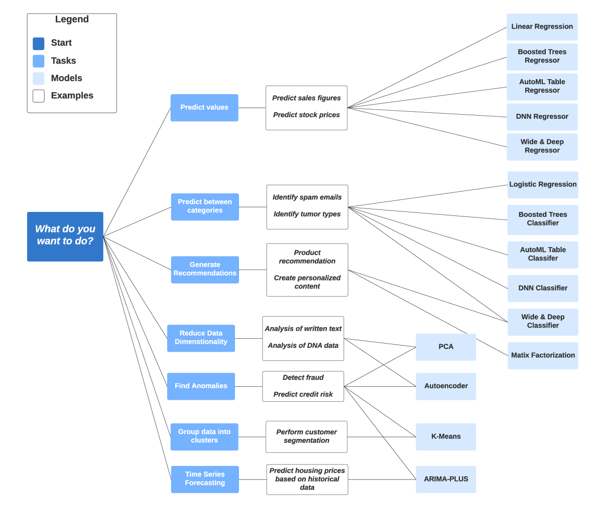
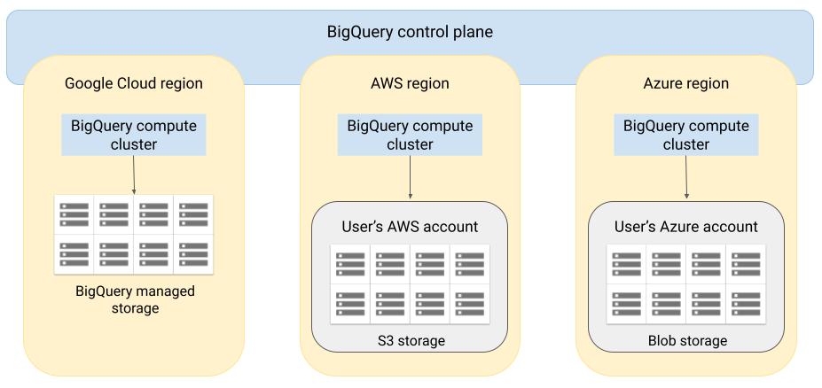
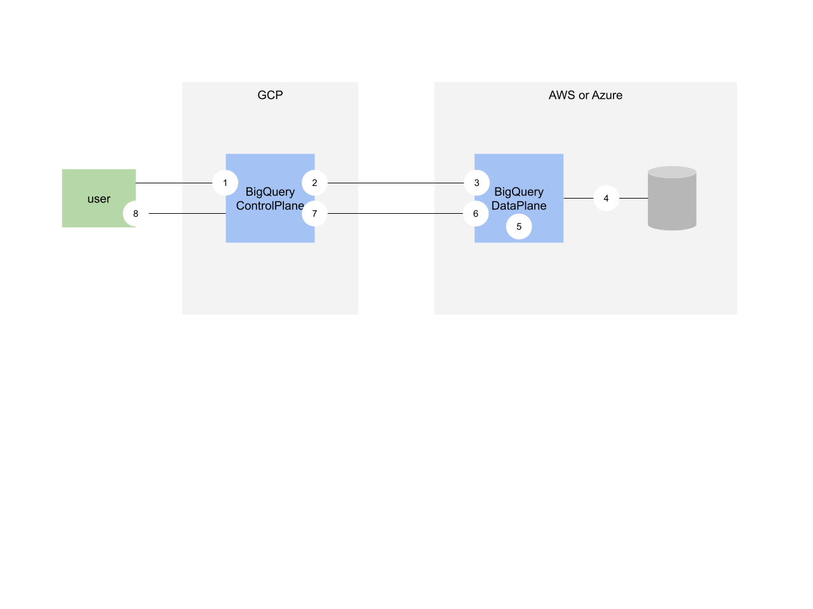

layout: true

.signature[@algogrit]

---

class: center, middle

# GCP BigQuery

Gaurav Agarwal

---

## Agenda

- BigQuery Concepts

  - Working with datasets

  - Schemas

  - Interacting with BQ

  - Tables / Views

- Querying

- Running & Managing Jobs

- Migrating from data warehouse

- Monitoring & Logging

- Other Features

  - Overview of BigQuery Data Transfer Service

---
class: center, middle

## BigQuery Concepts

---
class: center, middle

### Datasets

---
class: center, middle

A dataset is contained within a specific project.

---
class: center, middle

Datasets are top-level containers that are used to organize and control access to your tables and views.

---

#### Dataset Limitations

- You can set the geographic location at creation time only. After a dataset has been created, the location becomes immutable and can't be changed by using the Cloud Console, using the bq command-line tool, or calling the patch or update API methods.

- All tables that are referenced in a query MUST be stored in datasets in the same location.

- When you copy a table, the datasets that contain the source table and destination table must reside in the same location.

- Dataset names must be unique for each project.

---
class: center, middle

*BigQuery Organization*



.image-credits[https://cloud.google.com/bigquery/docs/resource-hierarchy]

---
class: center, middle

### BigQuery Tables

---
class: center, middle

Every table is defined by a schema that describes the column names, data types, and other information.

---
class: center, middle

### Defining Schema

---

You can specify the schema of a table

- when it is created, or

you can create a table without a schema and declare the schema

- in the query job or

- load job that first populates it with data

---
class: center, middle

#### Data Types

.content-credits[https://cloud.google.com/bigquery/docs/reference/standard-sql/data-types]

---

- String

- Bytes

- Integer

- Float

- Numeric

- BigNumeric

- Boolean

- Timestamp

---

- Date

- Time

- DateTime

- Geography

- Record (Nested)

---

##### Mode

- Nullable

- Required

- Repeated

---
class: center, middle

*Demo*: Creating a table with schema

---
class: center, middle

#### Schema auto-detection

---
class: center, middle

Schema auto-detection is available when you load data into BigQuery, and when you query an external data source.

---
class: center, middle

### Accessing the table from CLI - using `bq`

---
class: center, middle

*Challenge*: [Exploring BigQuery](https://github.com/AgarwalConsulting/gcp-training/blob/master/challenges/bigquery/01-exploration.md)

---

### Table types

- *Native tables*: tables backed by native BigQuery storage

- *External tables*: tables backed by storage external to BigQuery

- *Views*: Virtual tables defined by a SQL query

---

### Table limitations

- Table names must be unique per dataset.

- The Cloud Console supports copying only one table at a time.

- When you copy tables, the destination dataset must reside in the same location as the table being copied. For example, you cannot copy a table from an EU-based dataset to a US-based dataset.

- When you copy multiple source tables to a destination table by using the bq command-line tool, the API, or the client libraries, all source tables must have identical schemas.

- When you export table data, the only supported destination is Cloud Storage.

- When you use an API call, enumeration performance slows as you approach 50,000 tables in a dataset.

- The Cloud Console can display up to 50,000 tables for each dataset.

---
class: center, middle

## Partitioning & Clustering

---
class: center, middle

A partitioned table is a special table that is divided into segments, called partitions, that make it easier to manage and query your data.

---

Partition by

- *Time-unit column*: Tables are partitioned based on a `TIMESTAMP`, `DATE`, or `DATETIME` column in the table.

- *Ingestion time*: Tables are partitioned based on the timestamp when BigQuery ingests the data.

- *Integer range*: Tables are partitioned based on an integer column.

---
class: center, middle

When you create a clustered table in BigQuery, the table data is automatically organized based on the contents of one or more columns in the table’s schema.

---

- The columns you specify are used to colocate related data.

- When you cluster a table using multiple columns, the order of columns you specify is important.

- The order of the specified columns determines the sort order of the data.

---

Use clustering under the following circumstances:

- You don't need strict cost guarantees before running the query.

- You need more granularity than partitioning alone allows. To get clustering benefits in addition to partitioning benefits, you can use the same column for both partitioning and clustering.

- Your queries commonly use filters or aggregation against multiple particular columns.

- The cardinality of the number of values in a column or group of columns is large.

---

Use partitioning under the following circumstances:

- You want to know query costs before a query runs. Partition pruning is done before the query runs, so you can get the query cost after partitioning pruning through a dry run. Cluster pruning is done when the query runs, so the cost is known only after the query finishes.

- You need partition-level management. For example, you want to set a partition expiration time, load data to a specific partition, or delete partitions.

- You want to specify how the data is partitioned and what data is in each partition. For example, you want to define time granularity or define the ranges used to partition the table for integer range partitioning.

---

Prefer clustering over partitioning under the following circumstances:

- Partitioning results in a small amount of data per partition (approximately less than 1 GB).

- Partitioning results in a large number of partitions beyond the limits on partitioned tables.

- Partitioning results in your mutation operations modifying most partitions in the table frequently (for example, every few minutes).

---
class: center, middle

## Views

.content-credits[https://cloud.google.com/bigquery/docs/views-intro]

---
class: center, middle

A view is a virtual table defined by a SQL query. When you create a view, you query it in the same way you query a table.

---

### Create a view

- Using the Cloud Console

- Using the bq command-line tool's bq mk command

- Calling the `tables.insert` API method

- Using the client libraries

- Submitting a `CREATE VIEW` data definition language (DDL) statement

---
class: center, middle

### Materialized Views

---
class: center, middle

Materialized views are precomputed views that periodically cache the results of a query for increased performance and efficiency.

---

BigQuery Materialized Views can be beneficial in the following ways:

- Reduction in the execution time and cost for queries with aggregate functions.

- Automatic and transparent BigQuery query optimization.

- Aggregation of real-time data.

---
class: center, middle



---
class: center, middle

## Querying BigQuery

`bq query`

---
class: center, middle

BigQuery uses temporary tables to cache query results that aren't written to a permanent table.

---
class: center, middle

After a query finishes, the temporary table exists for up to 24 hours.

---
class: center, middle

### Specifying a destination table

`--destination_table`

---

To control the write disposition for an existing destination table, specify one of the following optional flags:

- `--append_table`: If the destination table exists, the query results are appended to it.

- `--replace`: If the destination table exists, it is overwritten with the query results.

---
class: center, middle

### Interactive and Batch query

---
class: center, middle

BigQuery runs interactive query jobs, which means that the query is executed as soon as possible.

---
class: center, middle

BigQuery queues each batch query on your behalf, and starts the query as soon as idle resources are available in the BigQuery shared resource pool.

---
class: center, middle

If BigQuery hasn't started the query within 24 hours, BigQuery changes the job priority to interactive.

---

- Interactive queries count toward your concurrent rate limit and your daily limit.

- Batch queries don't count towards your concurrent rate limit, which can make it easier to start many queries at once.

---
class: center, middle

`--batch` flag

---
class: center, middle

### Dry Run

`--dry_run`

.content-credits[https://cloud.google.com/bigquery/docs/dry-run-queries]

---
class: center, middle

### Parametrized Queries

.content-credits[https://cloud.google.com/bigquery/docs/parameterized-queries]

---
class: center, middle

BigQuery supports query parameters to help prevent SQL injection when queries are constructed using user input.

---
class: center, middle

To specify a named parameter, use the `@` character followed by an identifier, such as `@param_name`

---

```sql
-- #standardSQL
SELECT
  word,
  word_count
FROM
  `bigquery-public-data.samples.shakespeare`
WHERE
  corpus = @corpus
  AND word_count >= @min_word_count
ORDER BY
  word_count DESC
```

---
class: center, middle

Use `--parameter` to provide values for parameters in the form `name:type:value`.

---

- An empty name produces a positional parameter.

- The type may be omitted to assume `STRING`.

---

#### Using arrays in parameterized queries

```bash
bq query \
--use_legacy_sql=false \
--parameter='gender::M' \
--parameter='states:ARRAY<STRING>:["WA", "WI", "WV", "WY"]' \
'SELECT
  name,
  SUM(number) AS count
FROM
  `bigquery-public-data.usa_names.usa_1910_2013`
WHERE
  gender = @gender
  AND state IN UNNEST(@states)
GROUP BY
  name
ORDER BY
  count DESC
LIMIT
  10'
```

---

#### Using timestamps in parameterized queries

```bash
bq query \
--use_legacy_sql=false \
--parameter='ts_value:TIMESTAMP:2016-12-07 08:00:00' \
'SELECT
  TIMESTAMP_ADD(@ts_value, INTERVAL 1 HOUR)'
```

---

#### Using structs in parameterized queries

```bash
bq query \
--use_legacy_sql=false \
--parameter='struct_value:STRUCT<x INT64, y STRING>:{"x": 1, "y": "foo"}' \
'SELECT
  @struct_value AS s'
```

---
class: center, middle

### Table sampling

---
class: center, middle

Table sampling lets you query random subsets of data from large BigQuery tables.

---
class: center, middle

To use table sampling in a query, include the `TABLESAMPLE` clause

---
class: center, middle

Parameterized queries are not supported by the Cloud Console.

---
class: center, middle

### Wildcard table

---
class: center, middle

Wildcard tables enable you to query multiple tables using concise SQL statements.

---
class: center, middle

Filtering selected tables using `_TABLE_SUFFIX`

---

```sql
-- #standardSQL
SELECT
  max,
  ROUND((max-32)*5/9,1) celsius,
  mo,
  da,
  year
FROM
  `bigquery-public-data.noaa_gsod.gsod194*`
WHERE
  max != 9999.9 # code for missing data
  AND ( _TABLE_SUFFIX = '0'
    OR _TABLE_SUFFIX = '4' )
ORDER BY
  max DESC
```

---
class: center, middle

### Access historical data using time travel

---
class: center, middle

BigQuery lets you use time travel to access data stored in BigQuery that has been changed or deleted.

---

- You can access the data from any point within the last seven days.

- Time travel lets you query data that was updated or deleted, restore a table that was deleted, or restore a table that expired.

---

```sql
SELECT *
FROM `mydataset.mytable`
  FOR SYSTEM_TIME AS OF TIMESTAMP_SUB(CURRENT_TIMESTAMP(), INTERVAL 1 HOUR);
```

---
class: center, middle

If the timestamp specifies a time from more than seven days ago or from before the table was created, then the query fails and returns an error.

---

#### Restore a table

```bash
bq cp mydataset.table1@-3600000 mydataset.table1_restored
```

The time, `-3600000`, is specified in milliseconds using a relative offset.

---
class: center, middle

### Saved queries (only using console!)

---
class: center, middle

### Scheduling queries

---
class: center, middle

You can schedule queries to run on a recurring basis.

---

```sql
SELECT @run_time AS time,
  title,
  author,
  text
FROM `bigquery-public-data.hacker_news.stories`
LIMIT
  1000
```

---
class: center, middle

## Working with Standard SQL

.content-credits[https://cloud.google.com/bigquery/docs/reference/standard-sql/arrays]

---
class: center, middle

## Running & Managing Jobs

---
class: center, middle

Jobs are actions that BigQuery runs on your behalf to load data, export data, query data, or copy data.

---
class: center, middle

When you use the Cloud Console or the `bq` command-line tool to load, export, query, or copy data, a job resource is automatically created, scheduled, and run.

---
class: center, middle

You can also programmatically create a load, export, query, or copy job.

---

To run a BigQuery job programmatically using the REST API or client libraries, you:

- Call the `jobs.insert` method.

- Periodically request the job resource and examine the status property to learn when the job is complete.

- Check to see whether the job finished successfully.

---
class: center, middle

### Managing Jobs

.content-credits[https://cloud.google.com/bigquery/docs/managing-jobs#listing_jobs]

---

When a job is submitted, it can be in one of the following states:

- *PENDING*: The job is scheduled and waiting to be run.

- *RUNNING*: The job is in progress.

- *DONE*: The job is completed. If the job completes without errors, then BigQuery reports this state as *SUCCESS*. If the job completes with errors, then BigQuery reports this state as *FAILURE*.

---

#### Listing all jobs

```bash
bq ls --jobs=true --all=true $PROJECT_ID
```

---

Other operations

- Job details: `bq show`

- Cancel job: `bq cancel`

---
class: center, middle

## Query plan and timeline

---
class: center, middle

Embedded within query jobs, BigQuery includes diagnostic query plan and timing information.

---

- For long running queries, BigQuery will periodically update these statistics.

- These updates happen independently of the rate at which the job status is polled, but typically will not happen more frequently than every 30 seconds.

- Additionally, query jobs that do not leverage execution resources, such as dry run requests or results that can be served from cached results, will not include the additional diagnostic information, though other statistics may be present.

---
class: center, middle

*Challenge*: [Loading data into BigQuery](https://github.com/AgarwalConsulting/gcp-training/blob/master/challenges/bigquery/02-loading-data.md)

---
class: center, middle

## BigQuery Reservations

.content-credits[https://cloud.google.com/bigquery/docs/reservations-intro]

---
class: center, middle

Reservations enables you to switch between `on-demand pricing` and `flat-rate pricing`.

---

- *On-demand pricing*: You pay for the data scanned by your queries. You have a fixed, per-project query processing capacity, and your cost is based on the number of bytes processed.

- *Flat-rate pricing*: You purchase dedicated query processing capacity.

---
class: center, middle

## Monitoring & Administration

.content-credits[https://github.com/GoogleCloudPlatform/bigquery-utils/tree/master/dashboards/system_tables]

---

- [Monitoring & Logging](https://cloud.google.com/bigquery/docs/monitoring)

- [Administration](https://cloud.google.com/bigquery/docs/admin-intro)

---
class: center, middle

## Quotas and limits

.content-credits[https://cloud.google.com/bigquery/quotas]

---
class: center, middle

## Table Access Controls

.content-credits[https://cloud.google.com/bigquery/docs/table-access-controls-intro]

---
class: center, middle

## Other Features of BigQuery

---
class: center, middle

BigQuery maximizes flexibility by separating the compute engine that analyzes your data from your storage choices.

---
class: center, middle

You can store and analyze your data within BigQuery or use BigQuery to assess your data where it lives.

---

- BigQuery

- BigQuery ML

- Geospatial Analysis

- BigQuery Omni

- Data Transfer Service

---
class: center, middle

### BigQuery ML

---
class: center, middle

BigQuery ML lets you create and execute machine learning models in BigQuery using standard SQL queries.

---

#### Types of models

- Linear regression for forecasting; for example, the sales of an item on a given day. Labels are real-valued (they cannot be +/- infinity or NaN).

- Binary logistic regression for classification; for example, determining whether a customer will make a purchase. Labels must only have two possible values.

- Multiclass logistic regression for classification. These models can be used to predict multiple possible values such as whether an input is "low-value," "medium-value," or "high-value." Labels can have up to 50 unique values. In BigQuery ML, multiclass logistic regression training uses a multinomial classifier with a cross-entropy loss function.

- K-means clustering for data segmentation; for example, identifying customer segments. K-means is an unsupervised learning technique, so model training does not require labels nor split data for training or evaluation.

- Matrix Factorization for creating product recommendation systems. You can create product recommendations using historical customer behavior, transactions, and product ratings and then use those recommendations for personalized customer experiences.

---

#### Types of models (continued)

- Time series for performing time-series forecasts. You can use this feature to create millions of time series models and use them for forecasting. The model automatically handles anomalies, seasonality, and holidays.

- Boosted Tree for creating XGBoost based classification and regression models.

- Deep Neural Network (DNN) for creating TensorFlow-based Deep Neural Networks for classification and regression models.

- AutoML Tables to create best-in-class models without feature engineering or model selection. AutoML Tables searches through a variety of model architectures to decide the best model.

- TensorFlow model importing. This feature lets you create BigQuery ML models from previously trained TensorFlow models, then perform prediction in BigQuery ML.

- Autoencoder for creating Tensorflow-based BigQuery ML models with the support of sparse data representations. The models can be used in BigQuery ML for tasks such as unsupervised anomaly detection and non-linear dimensionality reduction.

---
class: center, middle



---
class: center, middle

*Demo*: [Create a binary logistic regression model](https://github.com/AgarwalConsulting/gcp-training/blob/master/examples/bigquery/bq-ml.md)

---

#### Results include

- *precision* — A metric for classification models. Precision identifies the frequency with which a model was correct when predicting the positive class.

- *recall* — A metric for classification models that answers the following question: Out of all the possible positive labels, how many did the model correctly identify?

- *accuracy* — Accuracy is the fraction of predictions that a classification model got right.

- *f1_score* — A measure of the accuracy of the model. The f1 score is the harmonic average of the precision and recall. An f1 score's best value is 1. The worst value is 0.

- *log_loss* — The loss function used in a logistic regression. This is the measure of how far the model's predictions are from the correct labels.

- *roc_auc* — The area under the ROC curve. This is the probability that a classifier is more confident that a randomly chosen positive example is actually positive than that a randomly chosen negative example is positive.

---
class: center, middle

### Geospatial Analytics

---
class: center, middle

Geospatial analytics let you analyze and visualize geospatial data in BigQuery by using geography data types and standard SQL geography functions.

---

#### Limitations

- Geography functions are available only in standard SQL.

- Only the BigQuery client library for Python currently supports the `GEOGRAPHY` data type.

- For other client libraries, convert `GEOGRAPHY` values to strings by using the `ST_ASTEXT` or `ST_ASGEOJSON` function.

  - Converting to text using `ST_AsText` stores only one value, and converting to `WKT` means that the data is annotated as a `STRING` type instead of a `GEOGRAPHY` type.

---
class: center, middle

*Demo*: [Working with Geospatial analytics](https://github.com/AgarwalConsulting/gcp-training/blob/master/examples/bigquery/geo-analytics.md)

---
class: center, middle

### BigQuery Omni

---
class: center, middle

BigQuery Omni lets you run BigQuery analytics on data stored in AWS S3 or Azure blob storage.

---

You don't necessarily want to move or copy the data to a central location, due to:

- cost

- time

- data governance

- problems caused by data duplication

---
class: center, middle

By using BigQuery Omni, you don't have to copy the data into Google Cloud. Instead, BigQuery Omni brings the BigQuery analytics engine to your data where it resides.

---
class: center, middle

BigQuery Omni extends the architecture by running the BigQuery query engine in other clouds.

---
class: center, middle

*Omni Architecture*



---

#### Omni limitations

- Only supports external tables

- Max result size of interactive queries is 2 MiB

- Materialized views are not supported

- Scheduled queries are only supported through the API or CLI

.content-credits[https://cloud.google.com/bigquery-omni/docs/introduction#limitations]

---
class: center, middle

*Data Flow between Google and AWS or Azure*



.content-credits[https://cloud.google.com/bigquery-omni/docs/dataprocessing]

---

1. BigQuery control plane receive query jobs from the customer via Cloud Console or the BigQuery CLI/API.

2. BigQuery control plane sends query jobs for processing to BigQuery data plane (on AWS/Azure)

3. BigQuery data plane receives query from the control plane through a VPN connection.

4. BigQuery data plane reads table data from customer owned storage buckets (AWS S3 or Azure Blob storage)

5. BigQuery data plane runs the query job on table data. Processing of table data occurs in the select AWS or Azure region

6. Query result (up to 2 MB) is transmitted from data plane to control plane via VPN connection.

7. BigQuery control plane receives query job results for display to customer in response to query job. This data is stored temporarily (up to 24 hrs).

8. Query result is returned to the user.

---
class: center, middle

### Loading data into BigQuery

---

There are several ways to ingest data into BigQuery:

- Batch load a set of data records

- Stream individual records or batches of records

- Use queries to generate new data and append or overwrite the results to a table

- Use a third-party application or service

---
class: center, middle

Code
https://github.com/AgarwalConsulting/presentation-gcp-bigquery

Slides
https://gcp-bigquery.slides.agarwalconsulting.io/
